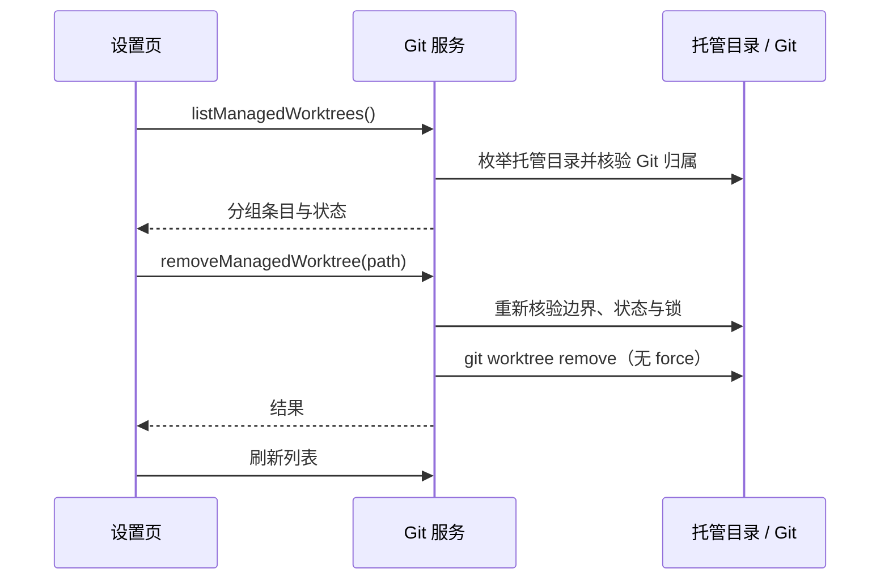

## Design

Git 服务是工作树目录、仓库归属和 Git 状态的唯一事实所有者。设置页只展示服务返回的托管条目，并调用既有 `onCreateTask(targetWorkspace)` 在工作树目录开始新草稿。列表只扫描 CodeZ 托管根目录中的容器，并以归属标记和 Git 信息核验，不依赖容器目录名。

创建时在容器内写入 CodeZ 标记；列表和删除只接受带有效标记且被 Git 注册为 linked worktree 的目录。托管目录默认位于 CodeZ 数据根目录下的 `worktrees`，可由全局设置指定绝对路径。Git 服务在每次创建、列出和移除时读取同一设置事实源，避免窗口中的旧设置决定目标目录。修改目录前，当前目录的托管工作树必须先移除，以免旧目录从管理页消失。本次没有自动清理、保留数量或创建前 fetch 开关。

手动移除时，服务重新核验真实路径、托管目录边界、Git worktree 关系，以及未提交、未跟踪和忽略文件，再执行 `git worktree remove`（无 force）。删除失败保留原目录与可见错误；成功后刷新列表。当前窗口已打开的工作树禁止移除；其他窗口的运行态不属于当前设置页可见事实，确认弹窗应提示用户先结束其他会话。目录不匹配、缺失、损坏或来源未知均不自动清理。

