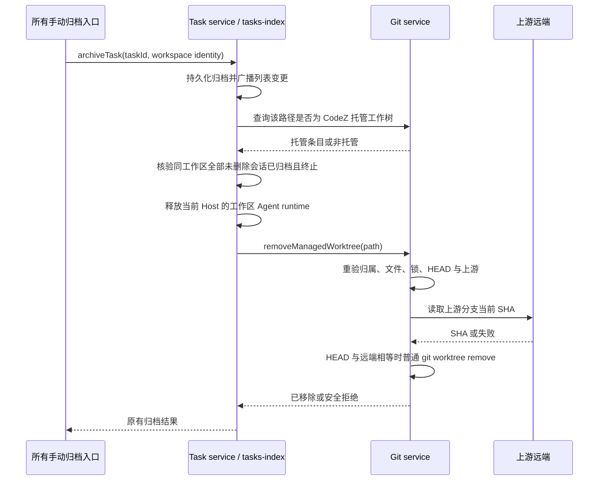

## 目标与边界

手动 `archiveTask` 是唯一触发点；自动旧任务归档、批量归档、取消归档和删除归档记录不触发清理。普通工作区与远程身份不调用 Git 清理。归档仍由任务索引持久化；Git 服务是工作树归属、文件状态与远端提交的唯一核验者。设置页保留原手动删除入口，但使用相同的 Git 安全门槛。

## 事件顺序与所有者

归档一旦持久化成功不回滚。清理失败只写 `warn` 并保留目录，不把已完成归档伪装成失败；没有自动重试队列，用户仍可在设置页手动移除。设置页的按钮状态可继续展示干净/锁定等本地信息，最终删除条件始终以 Git 服务在操作时的核验为准。

## 安全门槛

1. 目标必须有 CodeZ 标记、属于当前托管根目录且被源仓库注册为 linked worktree；路径仅用于文件操作，远程身份不能按相同字符串误判为本地。
2. 工作树必须无 tracked、untracked、ignored 文件变更且未锁定；容器只能包含标记与工作树。执行普通 `git worktree remove`，不用 `--force`。
3. HEAD 必须在本地分支上，分支配置真实远端上游。通过 `git for-each-ref` 读取上游的远端名与完整 ref，再以有界 `git ls-remote --exit-code` 实时读回；远端 SHA 必须与当前 HEAD 完全相同。detached、无上游、网络或认证失败、ref 缺失、SHA 不同均拒绝删除。这是保守的“已推送”证明；不尝试猜测其他远端/分支或用可能过期的 remote-tracking ref 代替。
4. 手动归档清理前，按 `workspaceIdentity?.trim() || workspacePath` 查询同工作区所有未删除任务。必须全部归档且 `status` 为 `completed` 或 `error`；状态未知或运行中保留目录。通过后释放当前 Host 的工作区 Agent runtime，避免 Windows cwd 占用阻止移除。Git 删除前再次校验文件和 HEAD，尽量收窄检查与删除之间的漂移窗口。

归档会话记录仍在任务索引和会话存储中，但工作树删除后不能直接在原路径续跑。当前范围不创建恢复快照或重建工作树；需要继续工作时在现有源仓库或新工作树开启会话。设置页继续提供手动清理作为未满足条件后的明确入口。

## 文件与验证

- `packages/services/src/git/repo/managedWorktrees.ts`：远端实时读回与删除前核验，复用现有托管枚举与 Git 命令提供者。
- `packages/services/src/zcode-agent/zcodeTaskServiceAdapter.ts`、`packages/services/src/node.ts`：归档完成后仅对托管本地路径检查任务占用并调用 Git 服务；保持原有返回类型和列表广播。
- 服务测试以本地 bare remote 验证已推送成功、未推送、detached、脏目录、其他未归档/运行中会话、普通路径和远端路径。运行 OpenSpec validate、受影响测试、类型检查、Lint、架构检查；打包后的桌面启动检查属于交付验证。
